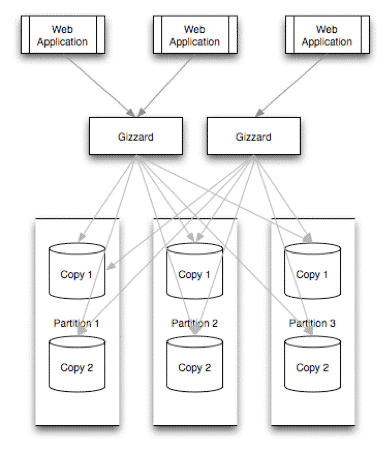
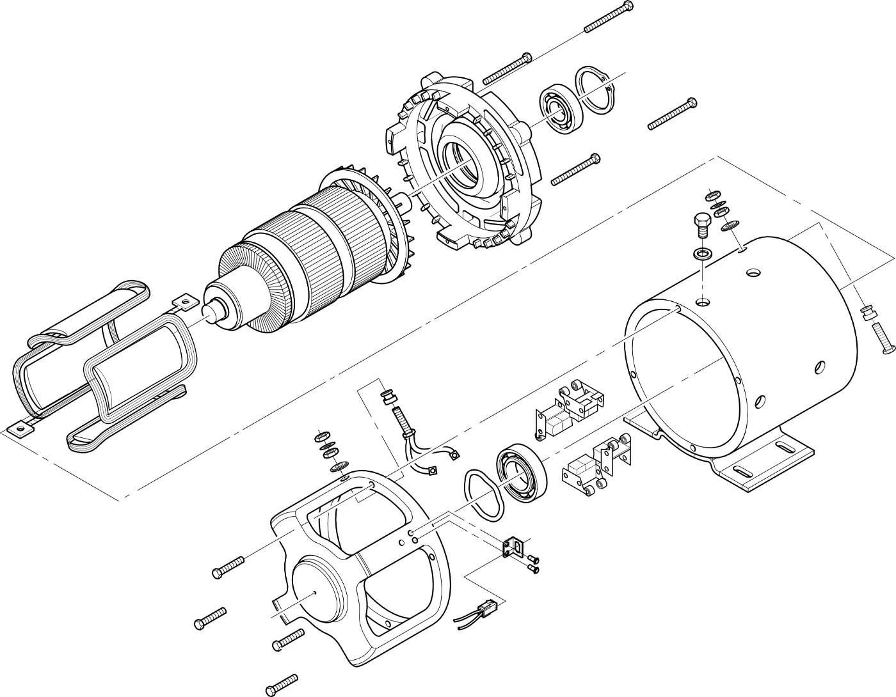
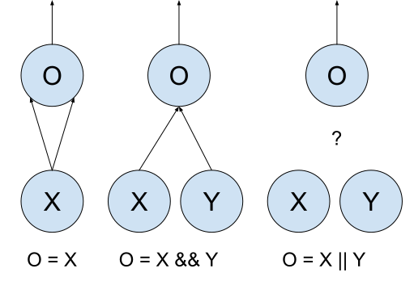
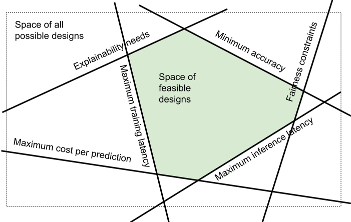

## After requirements...


<!-- .element: class="plain stretch" -->


----
## Learning Goals

* Describe the role of architecture and design between requirements and implementation
* Identify the different ML components and organize and prioritize their quality concerns for a given project
* Explain they key ideas behind decision trees and random forests and analyze consequences for various qualities
* Demonstrate an understanding of the key ideas of deep learning and how it drives qualities
* Plan and execute an evaluation of the qualities of alternative AI components for a given purpose

----
## Readings

Required reading: Hulten, Geoff. "Building Intelligent Systems: A
Guide to Machine Learning Engineering." (2018), Chapters 17 and 18

Recommended reading: Siebert, Julien, Lisa Joeckel, Jens Heidrich, Koji Nakamichi, Kyoko Ohashi, Isao Namba, Rieko Yamamoto, and Mikio Aoyama. “Towards Guidelines for Assessing Qualities of Machine Learning Systems.” In International Conference on the Quality of Information and Communications Technology, pp. 17–31. Springer, Cham, 2020.


---
# Recall: ML is a Component in a System in an Environment


----
<!-- colstart -->

<!-- .element: class="plain" -->

<!-- col -->

* **ML components** for transcription model, pipeline to train the model, monitoring infrastructure...
* **Non-ML components** for data storage, user interface, payment processing, ...
* User requirements and assumptions
* 
* System quality vs model quality
* System requirements vs model requirements
 
<!-- colend -->


----
## Recall: Systems Thinking


<!-- .element: class="plain stretch" -->

> A system is a set of inter-related components that work together in a particular environment to perform whatever functions are required to achieve the system's objective -- Donella Meadows


---
# Thinking like a Software Architect


<!-- .element: class="plain" -->

----
## So far: Requirements

* Identify goals for the system, define success metrics
* Understand requirements, specifications, and assumptions
* Consider risks, plan for mitigations to mistakes
* Approaching component requirements: Understand quality requirements and constraints for models and learning algorithms


----
## From Requirements to Implementations...

We know what to build, but how? How to we meet the quality goals?


<!-- .element: class="plain" -->

**Software architecture:** Key design decisions, early on, focused on key qualities

Architectural decisions are hard to change later


----
## Software Architecture

> The software architecture of a program or computing system is the **structure or structures** of the system, which comprise **software elements**, the ***externally visible properties*** of those elements, and the relationships among them.
> -- [Kazman et al. 2012](https://www.oreilly.com/library/view/software-architecture-in/9780132942799/?ar)

----
## How much Architecture/Design?

Software Engineering Theme: *Think before you code*

Like requirements: Upfront investment can prevent problems later, but slower initially

-> Focus on most important qualities early, but leave flexibility

----
## Quality Requirements Drive Architecture Design

Driven by requirements, identify most important qualities

Examples:
* Development cost, operational cost, time to release
* Scalability, availability, response time, throughput
* Security, safety, usability, fairness
* Ease of modifications and updates
* ML: Accuracy, ability to collect data, training latency


----

## Why Architecture? ([Kazman et al. 2012](https://www.oreilly.com/library/view/software-architecture-in/9780132942799/?ar))

<div class="small">

Represents earliest design decisions.

Aids in **communication** with stakeholders: Shows them “how” at a level they can understand, raising questions about whether it meets their needs

Defines **constraints** on implementation: Design decisions form “load-bearing walls” of application

Dictates **organizational structure**: Teams work on different components

Inhibits or enables **quality attributes**: Similar to design patterns

Supports **predicting** cost, quality, and schedule: Typically by predicting information for each component

Aids in software **evolution**: Reason about cost, design, and effect of changes

</div>

----

## Case Study: Twitter

<!-- .element: style="width:800px" -->


Note: Source and additional reading: Raffi. [New Tweets per second record, and how!](https://blog.twitter.com/engineering/en_us/a/2013/new-tweets-per-second-record-and-how.html) Twitter Blog, 2013

----

## Twitter - Caching Architecture


<!-- .element: class="stretch" -->

Notes:

* Running one of the world’s largest Ruby on Rails installations
* 200 engineers
* Monolithic: managing raw database, memcache, rendering the site, and * presenting the public APIs in one codebase
* Increasingly difficult to understand system; organizationally challenging to manage and parallelize engineering teams
* Reached the limit of throughput on our storage systems (MySQL); read and write hot spots throughout our databases
* Throwing machines at the problem; low throughput per machine (CPU + RAM limit, network not saturated)
* Optimization corner: trading off code readability vs performance

----

## Twitter's Redesign Goals

<div class="smallish">

* **Performance**
    * Improve median latency; lower outliers 
    * Reduce number of machines 10x
+ **Reliability**
    * Isolate failures
+ **Maintainability**
    * *"We wanted cleaner boundaries with “related” logic being in one place"*: 
encapsulation and modularity at the systems level (vs class/package level)
* **Modifiability**
    * Quicker release of new features: *"run small and empowered engineering teams that could make local decisions and ship user-facing changes, independent of other teams"*

</div>

<!-- references -->

Raffi. [New Tweets per second record, and how!](https://blog.twitter.com/engineering/en_us/a/2013/new-tweets-per-second-record-and-how.html) Twitter Blog, 2013

----
## Twitter: Redesign Decisions

<!-- colstart -->

* Ruby on Rails -> JVM/Scala 
* Monolith -> Microservices
* RPC framework with monitoring, connection pooling, failover strategies, loadbalancing, ... built in
* New storage solution, temporal clustering, "roughly sortable ids"
* Data driven decision making

<!-- col -->


<!-- .element: class="stretch" -->

<!-- colend -->
----

## Twitter Case Study: Key Insights

Architectural decisions affect entire systems, not only individual modules

Abstract, different abstractions for different scenarios

Reason about quality attributes early

Make architectural decisions explicit

Question: **Did the original architect make poor decisions?**


---
# Decomposition, Interfaces, and Responsibility Assignm.


<!-- .element: class="stretch" -->

----
## System Decomposition


<!-- .element: class="stretch plain" -->

Identify components and their responsibilities

Establishes interfaces and team boundaries


----
## Information Hiding

Decomposition enables scaling teams

Each team works on a component

Need to coordinate on *interfaces*, but implementations remain hidden

**Interface descriptions are crutial**
* Who is responsible for what
* Component requirements (specifications), behavioral and quality
* Especially consider nonlocal qualities: e.g., safety, privacy

Interfaces rarely fully specified in practice, source of conflicts


----
## Each system is different...


<!-- .element: class="stretch" -->


----
## Each system is different...

 
<!-- .element: class="stretch" -->

----
## Each system is different...


<!-- .element: style="width:700px" -->

----
## Each system is different...


<!-- .element: style="width:800px" -->


----
## System Decomposition

<div class="smallish">

Each system is different, identify important components


Examples:
* Personalized music recommendations: microserivce deployment in cloud, logging of user activitiy, nightly batch processing for inference, regular model updates, regular experimentation, easy fallback
* Transcription service: irregular user interactions, large model, expensive inference, inference latency not critical, rare model updates
* Autonomous vehicle: on-board hardware sets limits, real-time needs, safety critical, updates necessary, limited experimentation in practice, not always online
* Smart keyboard: privacy focused, small model, federated learning on user device, limited telemetry

</div>


----
## Common components

* **Model inference service**: Uses model to make predictions for input data
* **ML pipeline**: Infrastructure to train/update the model
* **Monitoring**: Observe model and system
* **Data sources**: Manual/crowdsourcing/logs/telemetry/...
* **Data management**: Storage and processing of data, often at scale
* **Feature store**: Reusable feature engineering code, cached feature computations

----
## Common System-Wide Design Challenges

Separating concerns, understanding interdependencies
* e.g., anticipating/breaking feedback loops, conflicting needs of components

Facilitating experimentation, updates with confidence

Separating training and inference and closing the loop
* e.g., collecting telemetry to learn from user interactions

Learn, serve, and observe at scale or with resource limits
* e.g., cloud deployment, embedded devices


---
# Scoping Relevant Qualities of ML Components

From System Quality Requirements to Component Quality Specifications


----
## AI = DL?


----
## ML Methods Today


----
## ML Model Selection

How do I decide which ML method to use for my project?

Criteria: Quality Attributes & Constraints

----
## Recall: Quality Attributes

<div class="small">

Meaurable or testable properties of a system that are used to indicate how well it satisfies its goals

Examples
  * Performance
  * Features
  * Reliability
  * Conformance
  * Durability
  * Serviceability
  * Aesthetics
  * Perceived quality
  * and many others
  
</div>

<!-- references -->

Reference:
Garvin, David A., [What Does Product Quality Really Mean](http://oqrm.org/English/What_does_product_quality_really_means.pdf). Sloan management review 25 (1984).

----
## Accuracy is not Everything

Beyond prediction accuracy, what qualities may be relevant for an ML component?

<!-- discussion -->

Note: Collect qualities on whiteboard


----
## Qualities of Interest?

Scenario: ML component for transcribing audio files 


<!-- .element: class="stretch" -->

Note: Which of the previously discussed qualities are relevant?
Which additional qualities may be relevant here?

Cost per transaction; how much does it cost to transcribe? How much do
we make?

----
## Qualities of Interest?

Scenario: Component for detecting lane markings in a vehicle


Note: Which of the previously discussed qualities are relevant?
Which additional qualities may be relevant here?

Realtime use

----
## Qualities of Interest?

Scenario: Component for detecting credit card frauds, as a service for banks


<!-- .element: class="stretch" -->


Note: Very high volume of transactions, low cost per transaction, frequent updates

Incrementality

<!-- Img src https://pixabay.com/photos/credit-card-payment-transaction-926862/ -->

----
## Common of ML Qualities to Consider

* Accuracy
* Correctness guarantees? Probabilistic guarantees (--> symbolic AI)
* How many features?
* How much data needed? Data quality important?
* Incremental training possible?
* Training time, memory need, model size -- depending on training data volume and feature size
* Inference time, energy efficiency, resources needed, scalability
* Interpretability, explainability
* Robustness, reproducibility, stability
* Security, privacy, fairness


----
## Preview: Interpretability/Explainability

<div class="smallish">

*"Why did the model predict X?"*

**Explaining predictions + Validating Models + Debugging**

```
IF age between 18–20 and sex is male THEN predict arrest
ELSE IF age between 21–23 and 2–3 prior offenses THEN predict arrest
ELSE IF more than three priors THEN predict arrest
ELSE predict no arrest
```

* Some models inherently simpler to understand
* Some tools may provide post-hoc explanations
* Explanations may be more or less truthful
* How to measure interpretability?

</div>

----
## Preview: Robustness

<!-- .element: style="width:800px" -->

* Small input modifications may change output
* Small training data modifications may change predictions
* How to measure robustness?


<!-- references -->
Image source: [OpenAI blog](https://openai.com/blog/adversarial-example-research/)


----
## Preview: Fairness


*Does the model perform differently for different populations?*

```
IF age between 18–20 and sex is male THEN predict arrest
ELSE IF age between 21–23 and 2–3 prior offenses THEN predict arrest
ELSE IF more than three priors THEN predict arrest
ELSE predict no arrest
```

* Many different notions of fairness
* Often caused by bias in training data
* Enforce invariants in model or apply corrections outside model
* Important consideration during requirements solicitation!


----
## Recall: Measuring Qualities

<div class="small">

* Define a metric: Define units of interest 
  - e.g., requests per second, max memory per inference, average training time in seconds for 1 million datasets
* Operationalize metric: Define measurement protocol
  - e.g., conduct experiment: train model with fixed dataset, report median training time across 5 runs, file size, average accuracy with leave-one-out cross-validation after hyperparameter tuning
  - e.g., ask 10 humans to independently label evaluation data, report
    reduction in error from the ML model over human predictions
* Describe all relevant factors: Inputs/experimental units used, configuration decisions and tuning, hardware used, protocol for manual steps

**On terminology:** *metric/measure* refer a method or standard format for measuring something; *operationalization* is identifying and implementing a method to measure some factor

</div>


----
## On terminology

Data scientists seem to speak of *model properties* when referring to accuracy, inference time, fairness, etc
  * ... but they also use this term for whether a *learning technique* can learn non-linear relationships or whether the learning algorithm is monotonic

Software engineering wording would usually be *quality attribute*, *quality requirement*, *quality specification*
  or *non-functional requirement*

<!-- .element: class="cornerimg" -->


---
# Common ML Methods and their Qualities

----
## Linear Regression: Qualities


* Tasks: Regression
* Qualities: __Advantages__: ??  __Drawbacks__: ??

Notes:
* Easy to interpret, low training cost, small model size
* Can't capture non-linear relationships well

----
## Decision Trees
<!-- colstart -->


<!-- .element: class="plain stretch" -->


----
## Building Decision Trees
<!-- colstart -->

<!-- .element: class="plain stretch" -->


<!-- col -->

* Identify all possible decisions
* Select the decision that best splits the dataset into distinct
  outcomes (typically via entropy or similar measure)
* Repeatedly further split subsets, until stopping criteria reached

<!-- colend -->

----
## Decision Trees: Qualities


<!-- .element: class="stretch" -->
  
* Tasks: Classification & regression
* Qualities: __Advantages__: ??  __Drawbacks__: ??

Notes:
* Easy to interpret (up to a size); can capture non-linearity; can do well with
  little data
* High risk of overfitting; possibly very large tree size
* Obvious ones: fairly small model size, low inference cost, 
no obvious incremental training; easy to interpret locally and 
even globally if shallow; easy to understand decision boundaries

<!-- <\!-- smallish -\-> -->
<!-- * Identify all possible decisions -->
<!-- * Select the decision that best splits the dataset into distinct outcomes (typically via entropy or similar measure) -->
<!-- * Repeatedly further split subsets, until stopping criteria reached -->


----
## Random Forests


* Train multiple trees on subsets of data or subsets of decisions.
* Return average prediction of multiple trees.
* Qualities: __Advantages__: ??  __Drawbacks__: ??

Note: Increased training time and model size, 
less prone to overfitting, more difficult to interpret


----

# Neural Networks


<!-- .element: class="stretch" -->


Note: Artificial neural networks are inspired by how biological neural networks work ("groups of chemically connected or functionally associated neurons" with synapses forming connections)

From "Texture of the Nervous System of Man and the Vertebrates" by Santiago Ramón y Cajal, via https://en.wikipedia.org/wiki/Neural_circuit#/media/File:Cajal_actx_inter.jpg

----
## Artificial Neural Networks

Simulating biological neural networks of neurons (nodes) and synapses (connections), popularized in 60s and 70s

Basic building blocks: Artificial neurons, with $n$ inputs and one output; output is activated if at least $m$ inputs are active


<!-- .element: class="stretch" -->

(assuming at least two activated inputs needed to activate output)

----
## Threshold Logic Unit / Perceptron

computing weighted sum of inputs + step function

$z = w_1 x_1 + w_2 x_2 + ... + w_n x_n = \mathbf{x}^T \mathbf{w}$

e.g., step: `$\phi$(z) = if (z<0) 0 else 1` 


<!-- .element: class="stretch" -->

----

<!-- colstart -->


<!-- .element: style="width:500px" -->

<!-- col -->

$o_1 = \phi(b_{1}  +  w_{1,1} x_1 + w_{1,2} x_2)$
$o_2 = \phi(b_{2}  +  w_{2,1} x_1 + w_{2,2} x_2)$
$o_3 = \phi(b_{3}  +  w_{3,1} x_1 + w_{3,2} x_2)$

<!-- colend -->

****
$f_{\mathbf{W},\mathbf{b}}(\mathbf{X})=\phi(\mathbf{W} \cdot \mathbf{X}+\mathbf{b})$

($\mathbf{W}$ and $\mathbf{b}$ are parameters of the model)

----
## Multiple Layers


<!-- .element: class="stretch" -->

Note: Layers are fully connected here, but layers may have different numbers of neurons

----
$f_{\mathbf{W}_h,\mathbf{b}_h,\mathbf{W}_o,\mathbf{b}_o}(\mathbf{X})=\phi( \mathbf{W}_o \cdot \phi(\mathbf{W}_h \cdot \mathbf{X}+\mathbf{b}_h)+\mathbf{b}_o)$


<!-- .element: class="stretch" -->

(matrix multiplications interleaved with step function)

----
## Learning Model Parameters (Backpropagation)

<div class="smallish">

Intuition:
- Initialize all weights with random values
- Compute prediction, remembering all intermediate activations
- If predicted output has an error (measured with a loss function), 
  + Compute how much each connection contributed to the error on output layer
  + Repeat computation on each lower layer
  + Tweak weights a little toward the correct output (gradient descent)
- Continue training until weights stabilize

Works efficiently only for certain $\phi$, typically logistic function: $\phi(z)=1/(1+exp(-z))$ or ReLU: $\phi(z)=max(0,z)$.

</div>

----
## Deep Learning

More layers

Layers with different numbers of neurons 

Different kinds of connections, e.g.,
  - Fully connected (feed forward)
  - Not fully connected (eg. convolutional networks)
  - Keeping state (eg. recurrent neural networks)
  - Skipping layers

<!-- references -->
See Chapter 10 in Géron, Aurélien. ”[Hands-On Machine Learning with Scikit-Learn, Keras, and TensorFlow](https://cmu.primo.exlibrisgroup.com/permalink/01CMU_INST/6lpsnm/alma991019662775504436)”, 2nd Edition (2019) or any other book on deep learning


Note: Essentially the same with more layers and different kinds of architectures.


----
## Deep Learning


* Tasks: Classification & regression
* Qualities: __Advantages__: ?? __Drawbacks__: ??

Notes:
* High accuracy; can capture a wide range of problems (linear & non-linear)
* Difficult to interpret; high training costs (time & amount of
data required, hyperparameter tuning)


----
## Example Scenario

*MNIST Fashion dataset of 70k 28x28 grayscale pixel images, 10 output classes*


<!-- .element: class="stretch" -->

----
## Example Scenario

* MNIST Fashion dataset of 70k 28x28 grayscale pixel images, 10 output classes
* 28x28 = 784 inputs in input layers (each 0..255)
* Example model with 3 layers, 300, 100, and 10 neurons

```python
model = keras.models.Sequential([
  keras.layers.Flatten(input_shape=[28, 28]),
  keras.layers.Dense(300, activation="relu"),
  keras.layers.Dense(100, activation="relu"),
  keras.layers.Dense(10, activation="softmax")
])
```

**How many parameters does this model have?**

----
## Example Scenario

```python
model = keras.models.Sequential([
  keras.layers.Flatten(input_shape=[28, 28]),
  # 784*300+300 = 235500 parameter
  keras.layers.Dense(300, activation="relu"), 
  # 300*100+100 = 30100 parameters
  keras.layers.Dense(100, activation="relu"),
  # 100*10+10 = 1010 parameters
  keras.layers.Dense(10, activation="softmax")
])
```

Total of 266,610 parameters in this small example! (Assuming float types, that's 1 MB)

----
## Network Size

<div class="smallish">

* 50 Layer ResNet network -- classifying 224x224 images into 1000 categories
  * 26 million weights, computes 16 million activations during inference, 168 MB to store weights as floats
* Google in 2012(!): 1TB-1PB of training data, 1 billion to 1 trillion parameters
* OpenAI’s GPT-2 (2019) -- text generation
  - 48 layers, 1.5 billion weights (~12 GB to store weights)
  - released model reduced to 117 million weights
  - trained on 7-8 GPUs for 1 month with 40GB of internet text from 8 million web pages
* OpenAI’s GPT-3 (2020): 96 layers, 175 billion weights, 700 GB in memory, $4.6M in approximate compute cost for training
</div>

Notes: https://lambdalabs.com/blog/demystifying-gpt-3/

----
## Cost & Energy Consumption

<div class="smallish">

  <!-- colstart -->

| Consumption | CO2 (lbs) |
| - | - |
| Air travel, 1 passenger, NY↔SF | 1984 |
| Human life, avg, 1 year | 11,023 |
| American life, avg, 1 year | 36,156 |
| Car, avg incl. fuel, 1 lifetime | 126,000 |

<!-- col -->

| Training one model (GPU) | CO2 (lbs) |
| - | - |
| NLP pipeline (parsing, SRL) | 39 |
| w/ tuning & experimentation | 78,468 |
| Transformer (big) | 192 |
| w/ neural architecture search | 626,155 |

<!-- colend -->

</div>

<!-- references -->
Strubell, Emma, Ananya Ganesh, and Andrew McCallum. "[Energy and Policy Considerations for Deep Learning in NLP](https://arxiv.org/pdf/1906.02243.pdf)." In Proc. ACL, pp. 3645-3650. 2019.


----
## Cost & Energy Consumption


| Model | Hardware | Hours | CO2 | Cloud cost in USD |
| - | - | - | - | - |
| Transformer | P100x8 | 84 | 192 | 289–981 |
| ELMo | P100x3 | 336 | 262 | 433–1472 |
| BERT | V100x64 | 79 | 1438 | 3751–13K |
| NAS | P100x8 | 274,120 | 626,155 | 943K–3.2M |
| GPT-2 | TPUv3x32 | 168 | — | 13K–43K |
| GPT-3 |  |  | — | 4.6M |


<!-- references -->
Strubell, Emma, Ananya Ganesh, and Andrew McCallum. "[Energy and Policy Considerations for Deep Learning in NLP](https://arxiv.org/pdf/1906.02243.pdf)." In Proc. ACL, pp. 3645-3650. 2019.


---
# Constraints and Tradeoffs


<!-- .element: class="stretch plain" -->


----
## ML Model Selection

How do I decide which ML method to use for my project?

Criteria: Quality Attributes & Constraints

----
## Constraints

Constraints define the space of attributes for valid design solutions


<!-- .element: class="stretch plain" -->

Note: Design space exploration: The space of all possible designs (dotted rectangle) is reduced by several constraints on qualities of the system, leaving only a subset of designs for further consideration (highlighted center area).


----
## Types of Constraints

Problem constraints: Minimum required QAs for an acceptable product

Project constraints: Deadline, project budget, available skills

Design constraints: Type of ML task required (regression/classification), kind of available data, limits on computing resources, max. inference cost

**Plausible constraints for cancer prognosis? For music recommendations?**


----
## Trade-offs between ML methods

If there are multiple ML methods that satisfy the given constraints, which
one do we select?

Different ML qualities may conflict with each other; this requires
making a __trade-off__ between these qualities

Among the qualities of interest, which one(s) do we care the most
about?
* And which ML method is most suitable for achieving those qualities?
* (Similar to requirements conflicts)

----
## Multi-Objective Optimization

<!-- colstart -->

* Determine optimal solutions given multiple, possibly
  **conflicting** objectives
* **Dominated** solution: A solution that is inferior to
  others in every way 
* **Pareto frontier**: A set of non-dominated solutions
* Consider trade-offs among Pareto optimal solutions

<!-- col -->


<!-- .element: class="stretch plain" -->

<!-- colend -->

Note: Tradeoffs among multiple design solutions along two dimensions (cost and error). Gray solutions are all dominated by others that are better both in terms of cost and error (e.g., solution D has worse error and worse cost than solution A). The remaining black solutions are each better than another solution on one dimension but worse on another — they are all pareto optimal and which solution to pick depends on the relative importance of the dimensions.


----
## Trade-offs: Cost vs Accuracy

<!-- colstart -->


<!-- .element: class="stretch" -->

<!-- col -->

_"We evaluated some of the new methods offline but the additional
accuracy gains that we measured did not seem to justify the
engineering effort needed to bring them into a production
environment.”_

<!-- colend -->

<!-- references_ -->

Amatriain & Basilico. [Netflix Recommendations: Beyond the 5 stars](https://netflixtechblog.com/netflix-recommendations-beyond-the-5-stars-part-1-55838468f429),
Netflix Technology Blog (2012)

----
## Trade-offs: Accuracy vs Interpretability


<!-- .element: class="stretch" -->

<!-- references_ -->

Bloom & Brink. [Overcoming the Barriers to Production-Ready Machine Learning
Workflows](https://conferences.oreilly.com/strata/strata2014/public/schedule/detail/32314), Presentation at O'Reilly Strata Conference (2014).

----
## Breakout: Qualities & ML Methods

Consider two scenarios:
1. Credit card fraud detection
2. Pedestrian detection in sidewalk robot

As a group, post to `#lecture` tagging all group members:
>  * Constraints: ??
>  * Qualities of interests: ??
>  * ML method(s) to use: ??


---
# Summary

Software architecture focuses on early key design decisions, focused on key qualities

Between requirements and implementation

Decomposing the system into components, many ML components
 
Many qualities of interest, define metrics and operationalize

Constraints and tradeoff analysis for selecting ML techniques in production ML settings


----
## Further Readings

<div class="small">

* Bass, Len, Paul Clements, and Rick Kazman. Software architecture in practice. Addison-Wesley Professional, 3rd edition, 2012.
* Yokoyama, Haruki. “Machine learning system architectural pattern for improving operational stability.” In 2019 IEEE International Conference on Software Architecture Companion (ICSA-C), pp. 267–274. IEEE, 2019.
* Serban, Alex, and Joost Visser. “An Empirical Study of Software Architecture for Machine Learning.” In Proceedings of the International Conference on Software Analysis, Evolution and Reengineering (SANER), 2022.
* Lakshmanan, Valliappa, Sara Robinson, and Michael Munn. Machine learning design patterns. O’Reilly Media, 2020.
* Lewis, Grace A., Ipek Ozkaya, and Xiwei Xu. “Software Architecture Challenges for ML Systems.” In 2021 IEEE International Conference on Software Maintenance and Evolution (ICSME), pp. 634–638. IEEE, 2021.
* Vogelsang, Andreas, and Markus Borg. “Requirements Engineering for Machine Learning: Perspectives from Data Scientists.” In Proc. of the 6th International Workshop on Artificial Intelligence for Requirements Engineering (AIRE), 2019.


</div>